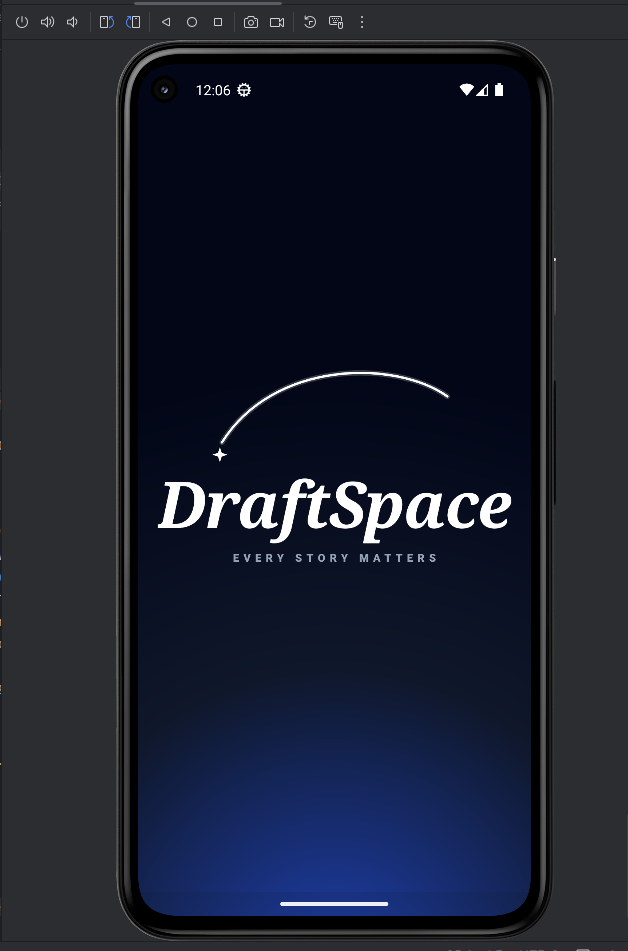
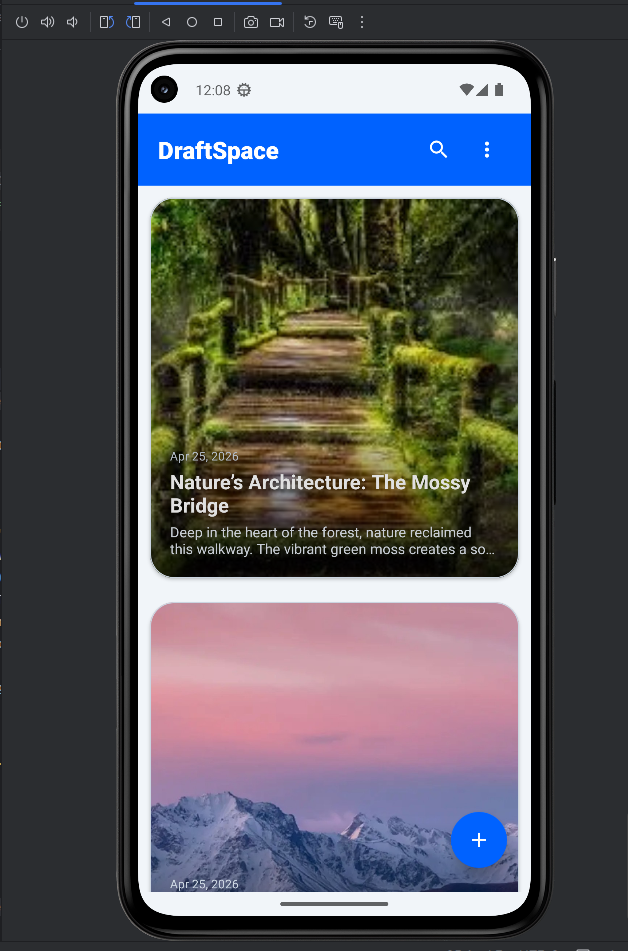
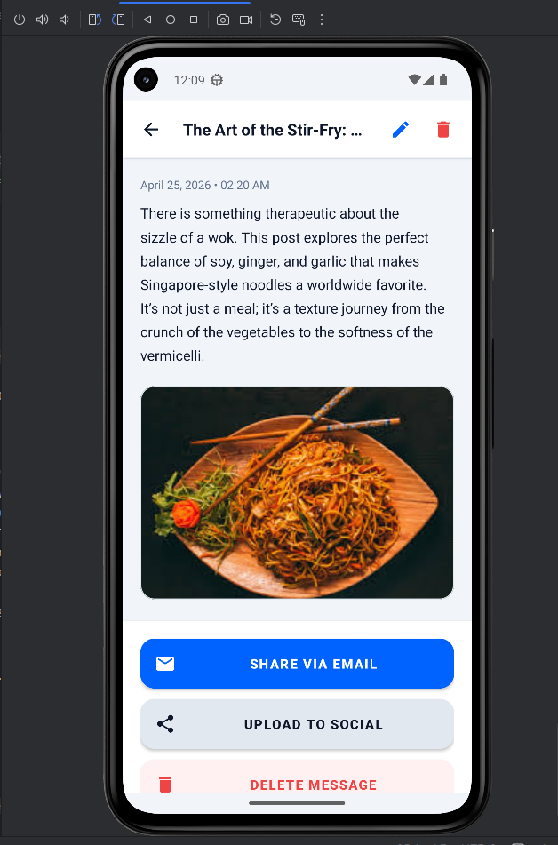
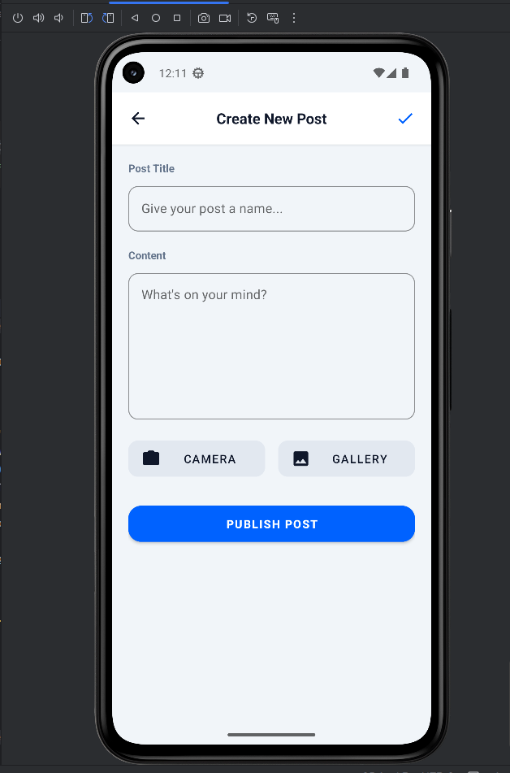
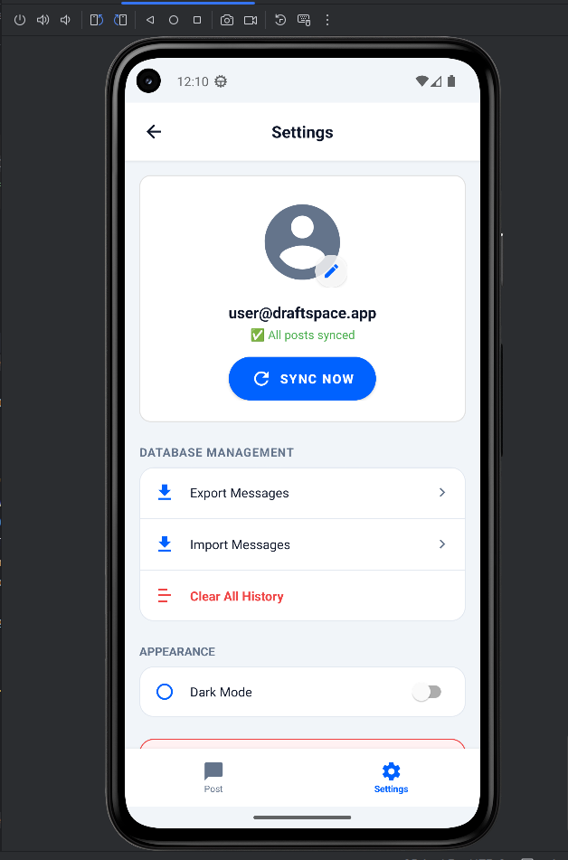

# DraftSpace 📝

An offline-first Android blogging and social media client. Write posts anywhere, share them when you're online.

---

## Screenshots

| Splash Screen | Home |
|:---:|:---:|
|  |  |

| View Post | Create Post |
|:---:|:---:|
|  |  |

| Settings & Sync |
|:---:|
|  |

---

## Features

- **Create & Edit Posts** — write posts with a title, body, and optional image attachment
- **Camera & Gallery** — attach photos directly from your camera or pick from the gallery
- **Offline First** — all posts saved locally to SQLite; works with no internet connection
- **Multi-Select Delete** — long press any post to enter selection mode, then delete in bulk
- **Search** — real-time keyword search across titles and body text with yellow highlight
- **Filter Chips** — sort by most recent, oldest, or filter to posts with images only
- **Share via Email** — send any post to an email address via Gmail, Outlook, or any mail app
- **Upload to Social** — share posts to Twitter, Facebook, Blogger, Medium, Tumblr, or Imgur
- **Sync Pending Posts** — posts created offline are flagged as pending and synced when online
- **Settings** — view pending sync count, trigger manual sync, or clear all local data

---

## Tech Stack

| Layer | Technology |
|---|---|
| Language | Java |
| Architecture | Single-Activity + Multi-Fragment (Jetpack Navigation) |
| UI | ViewBinding, RecyclerView, Material Design |
| Local Database | SQLite via SQLiteOpenHelper |
| Image Loading | Glide |
| Camera | ActivityResultLauncher + FileProvider |
| Connectivity | NetworkCapabilities (API 23+) |
| Min SDK | API 21 (Android 5.0) |
| Target SDK | API 34 (Android 14) |

---

## Project Structure

```
app/src/main/java/com/example/chatapp/
│
├── MainActivity.java          # Single-Activity host, NavController
├── SplashActivity.java        # 2-second splash screen
│
├── HomeFragment.java          # Post list, multi-select delete
├── CreateEditFragment.java    # Create & edit posts, camera/gallery
├── MessageViewFragment.java   # Full post view, edit/delete/share
├── SearchFragment.java        # Real-time search with filter chips
├── EmailShareFragment.java    # Email sharing via Android Intent
├── UploadSocialFragment.java  # Social media upload
├── SettingsFragment.java      # Sync controls, clear data
│
├── DatabaseHelper.java        # SQLite CRUD, search, sync status
├── MessageAdapter.java        # RecyclerView adapter, multi-select
├── Message.java               # Data model
└── NetworkUtils.java          # Connectivity check
```

---

## Getting Started

### Prerequisites
- Android Studio Ladybug (2024.2.1) or later
- Android device or emulator running API 21+

### Installation

1. Clone the repository
   ```bash
   git clone https://github.com/JananiUpeksha/Blogging-Application.git
   ```

2. Open the project in Android Studio

3. Let Gradle sync and resolve dependencies

4. Run on an emulator or physical device
   ```
   Run > Run 'app'
   ```

No API keys or server setup required — the app is fully self-contained and runs offline out of the box.

---

## How It Works

### Offline-First Storage
Every post is saved immediately to a local SQLite database with an `is_pending = 1` flag. The app works fully without an internet connection. When you come back online, go to **Settings → Sync Now** to mark all pending posts as synced.

### Image Attachment
Tap the **Camera** or **Gallery** button in the Create/Edit screen. The camera flow uses `FileProvider` to safely create a file URI on API 24+. The gallery uses `ACTION_OPEN_DOCUMENT` to return a persistent content URI. Images are loaded everywhere using Glide with disk caching.

### Multi-Select Delete
**Long press** any post card on the Home screen to enter selection mode. Tap additional cards to select them, then tap the delete icon in the header to bulk delete with a confirmation dialog.

### Sharing
Both **Email** and **Social Upload** screens check for internet connectivity before allowing any action. If you're offline, all share buttons are disabled and a dialog with a shortcut to Wi-Fi Settings is shown.

---

## Database Schema

```sql
CREATE TABLE messages (
    _id         INTEGER PRIMARY KEY AUTOINCREMENT,
    title       TEXT NOT NULL,
    body        TEXT,
    image_path  TEXT,
    timestamp   INTEGER,
    is_pending  INTEGER DEFAULT 1
);
```

---
